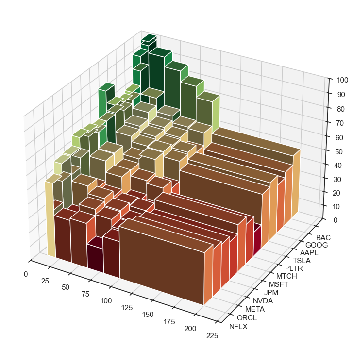

# Deep LOB
<p align="center"></p>

This repository provides a comprehensive framework for limit order book (LOB) analysis, including data processing, model training/testing, transfer learning, and algorithmic trading capabilities.This repository was created for academic research purposes.

## Preliminaries

To install the required python packages, please run the following command before attempting to run any scripts.

```pip install -r requirements_windows.txt```

## Usage

The main entry point is `main.py`, which uses Hydra for configuration management. All functionality is controlled through command line arguments.


### Data Processing

Process raw data from the `data/raw` folder into different representations. The raw files need to be directly from lobster.com, both the orderbook and the message files are required for each day you are processing.

```bash
# Basic data processing
python main.py ++steps=["PROCESS_DATA"] ++representation="ORDERBOOKS"

# Process with different representations
python main.py ++steps=["PROCESS_DATA"] ++representation="ORDERFLOWS"
python main.py ++steps=["PROCESS_DATA"] ++representation="ORDERVOL" 
python main.py ++steps=["PROCESS_DATA"] ++representation="ORDERFIXEDVOL"

# Process with scaling and row limits
python main.py ++steps=["PROCESS_DATA"] ++representation="ORDERFLOWS" ++scaling=True ++rowLim=250000
```

### Model Training

Train models on processed data:

```bash
# Basic training
python main.py ++steps=["TRAIN"] ++ticker='["MSFT"]' ++numEpoch=10

# Training with specific parameters
python main.py ++lookForwardHorizon=[5,10,20,50,100] ++ticker='["MSFT"]' ++numEpoch=3 ++representation="ORDERFLOWS" ++model="deepLOBREG_TF" ++rowLim=100000 ++labelType="REGRESSION"

# Categorical classification training
python main.py ++ticker='["AAPL"]' ++representation="ORDERBOOKS" ++model="deepLOB_TF" ++labelType="CATEGORICAL" ++numEpoch=5
```

### Model Testing

Test trained models:

```bash
# Basic testing
python main.py ++steps=["TEST"] ++ticker='["MSFT"]' ++representation="ORDERFLOWS"

# Test with specific model and parameters
python main.py ++steps=["TEST"] ++lookForwardHorizon=[20] ++ticker='["MSFT"]' ++representation="ORDERFLOWS" ++model="deepLOB_TF" ++rowLim=100000
```

### Transfer Learning

Apply pre-trained models to new data:

```bash
# Transfer learning with pre-trained weights
python main.py ++steps=["TRANSFER_LEARNING"] ++lookForwardHorizon=[20] ++ticker='["MSFT"]' ++representation="ORDERFLOWS" ++model="deepLOB_TF" ++rowLim=100000 ++labelType="CATEGORICAL" ++weightsRunID="Ov888KGE"
```

### Algorithmic Trading

Run algorithmic trading simulations:

```bash
# Basic algo trading
python main.py ++steps=["ALGO_TRADING"] ++ticker='["AAPL","NVDA","GOOG"]' ++date="2025-06-05"

# Advanced algo trading with multiple parameters
python main.py ++steps=["ALGO_TRADING"] ++horizon='[20,40,60]' ++rowLim=100000 ++windowLength=100 ++ticker='["AAPL","NVDA","GOOG"]' ++date="2025-06-05" ++signalPercentage=15 ++plot=False ++modelClass='["LinearRegressionModel"]' ++representation="ORDERFLOWS" ++tradingFees=True ++slippage=True
```

### Combined Workflows

Run multiple steps in sequence:

```bash
# Full pipeline: process data, train, and test
python main.py ++steps=["PROCESS_DATA","TRAIN","TEST"] ++ticker='["MSFT"]' ++representation="ORDERFLOWS" ++numEpoch=5

# Train and test with transfer learning
python main.py ++steps=["TRAIN","TRANSFER_LEARNING"] ++ticker='["MSFT"]' ++representation="ORDERFLOWS"
```

### Key Parameters

- `++steps`: List of steps to execute - `["PROCESS_DATA", "TRAIN", "TEST", "TRANSFER_LEARNING", "ALGO_TRADING"]`
- `++ticker`: List of stock tickers - `'["MSFT", "AAPL", "GOOG"]'`
- `++representation`: Data representation - `"ORDERBOOKS"`, `"ORDERFLOWS"`, `"ORDERVOL"`, `"ORDERFIXEDVOL"`
- `++model`: Model architecture - `"deepLOB_TF"`, `"deepLOBREG_TF"`
- `++labelType`: Label type - `"CATEGORICAL"`, `"REGRESSION"`
- `++lookForwardHorizon`: Prediction horizons - `[5,10,20,50,100]`
- `++numEpoch`: Number of training epochs
- `++rowLim`: Row limit for data processing
- `++weightsRunID`: Pre-trained model weights ID for transfer learning

### Configuration

Default configuration is stored in the Hydra config files. You can override any parameter using the `++parameter=value` syntax. For more complex configurations, modify the config files directly in the `conf/` directory.

### Examples

```bash
# Quick test with minimal data
python main.py ++ticker='["MSFT"]' ++numEpoch=1 ++rowLim=10000

# Full production run
python main.py ++lookForwardHorizon=[5,10,20,50,100,200] ++ticker='["MSFT","AAPL","GOOG","NVDA"]' ++numEpoch=50 ++representation="ORDERFLOWS" ++model="deepLOBREG_TF" ++labelType="REGRESSION"

# Algo trading simulation
python main.py ++steps=["ALGO_TRADING"] ++horizon='[20,40,60]' ++ticker='["AAPL","NVDA"]' ++date="2025-06-05" ++tradingFees=True ++saveResults=True
```

### Code Sources
1. https://github.com/FinancialComputingUCL/LOBFrame
2. https://github.com/lorenzolucchese/deepOBs
3. https://github.com/zcakhaa/DeepLOB-Deep-Convolutional-Neural-Networks-for-Limit-Order-Books